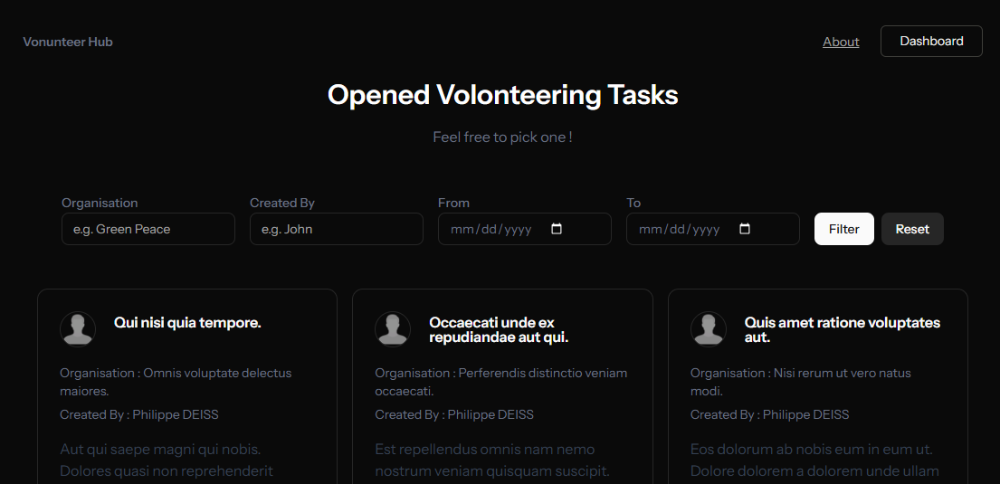
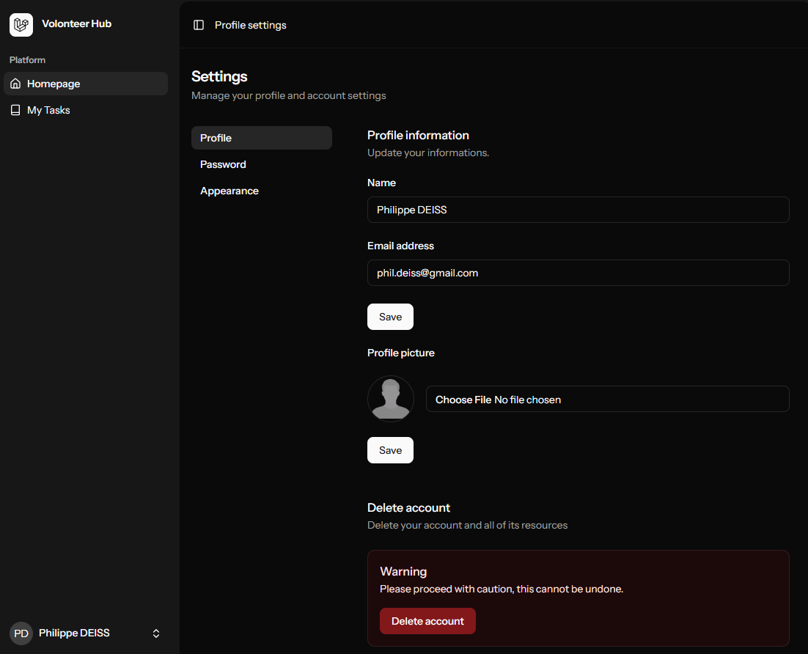

App demo link : https://volunteerhub.osc-fr1.scalingo.io/

A mini-platform where associations and non-profit organisations can publish local volunteering missions, and volunteers can easily find opportunities to help.

Enjoy!

---

## Overview





**Volunteer Hub** is a web application built to connect people who want to help with organizations that need them.  
It allows users to:

- Browse available volunteering tasks.
- Filter tasks by organisation, subject, or date range.
- Register and create new volunteering offers.
- Manage their profile and upload a profile picture.
- Display comments related for a task.

This project is still under active development (WIP), so expect frequent updates and improvements.

---

## Tech Stack

**Frontend:**
- [React](https://react.dev/) + [TypeScript](https://www.typescriptlang.org/)
- [Inertia.js](https://inertiajs.com/) for seamless SPA navigation
- [ShadCN/UI](https://ui.shadcn.com/) for UI components
- [Tailwind CSS](https://tailwindcss.com/) for styling

**Backend:**
- [Laravel](https://laravel.com/) (PHP)

**Other Tools:**
- Vite for fast builds
- Typescript for code quality

---

## Installation

### 1. Clone the repository
```bash
git clone https://github.com/yourusername/volunteer-hub.git
cd volunteer-hub
```

### 2. Manage backend dependencies
```bash
composer install
cp .env.example .env
php artisan key:generate
php artisan storage:link
```

And configure your .env file.

### 3. Manage frontend dependencies
```bash
npm install
```

### 3. Run project locally
```bash
composer run dev -> runs vite and hosts laravel locally
```

## Notes

Uses sqlite as default database.

Project uses google captcha V3. Please input yout private and public keys into the .env.

## Additional Notes

### testing CI locally

Needs 'github actions act' library installed locally

Run CI locally:
```bash
./bin/act push
```

### Playwright e2e testing

Copy and adapt .env.e2e.example to .env

Currently supported DB: sqlite

To execute e2e tests, run:
```bash
php artisan migrate:fresh --seeder=E2eDatabaseSeeder && npx playwright test
```
